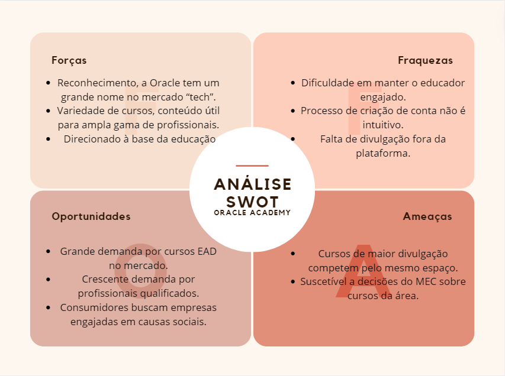
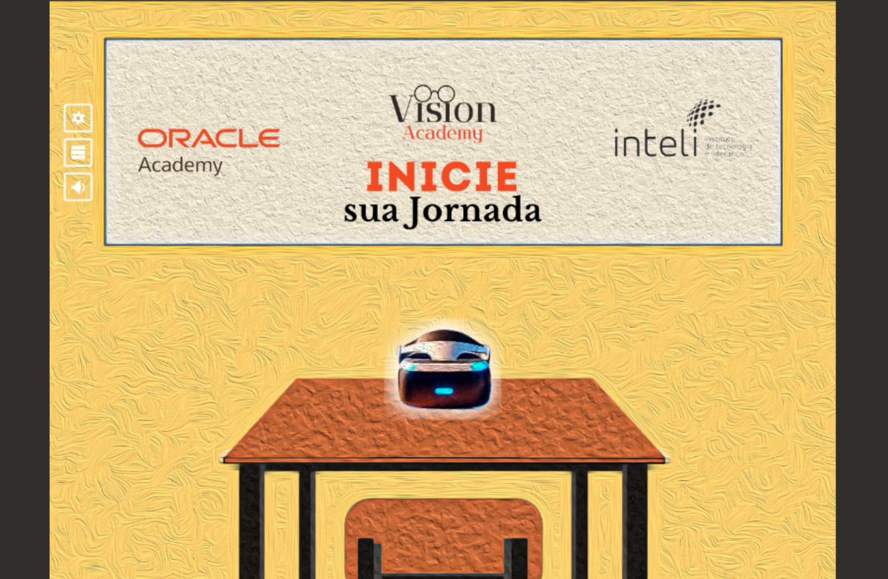
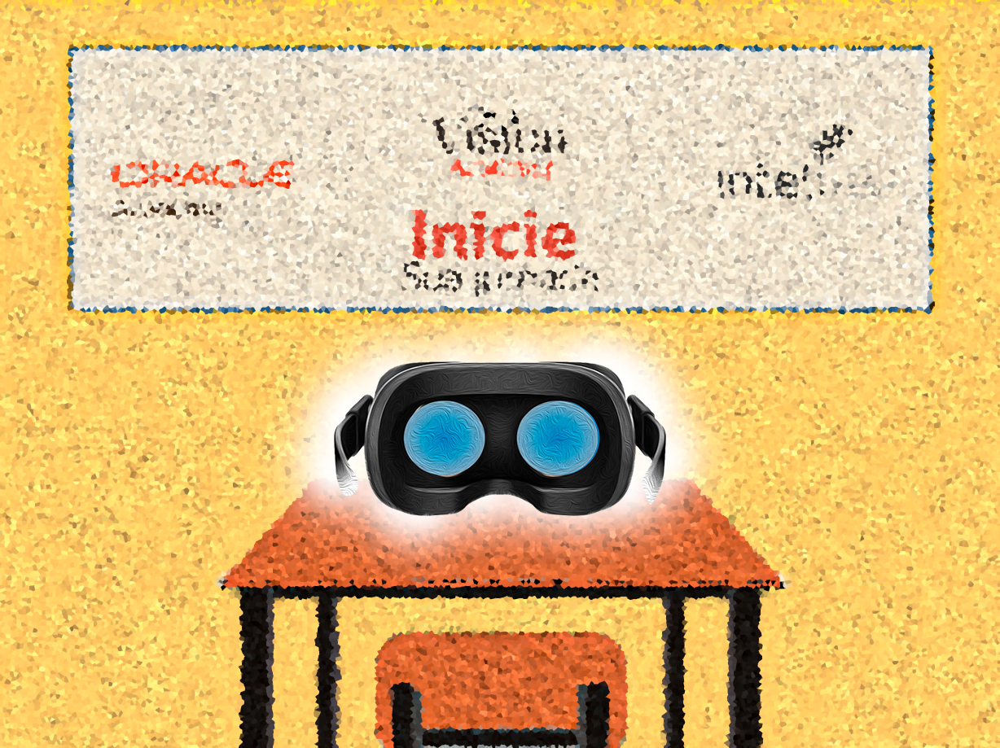
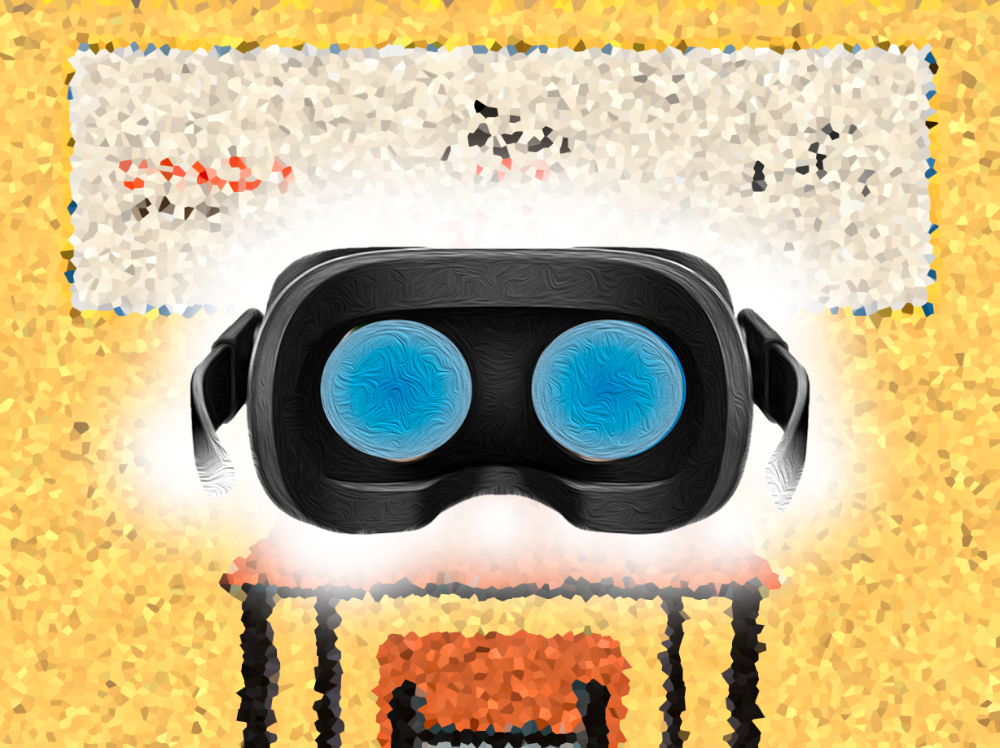
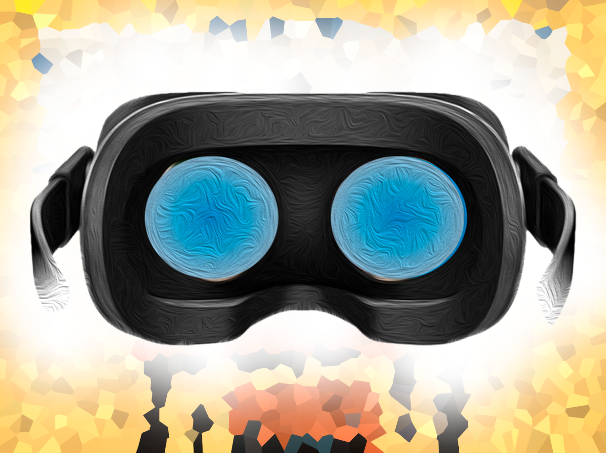
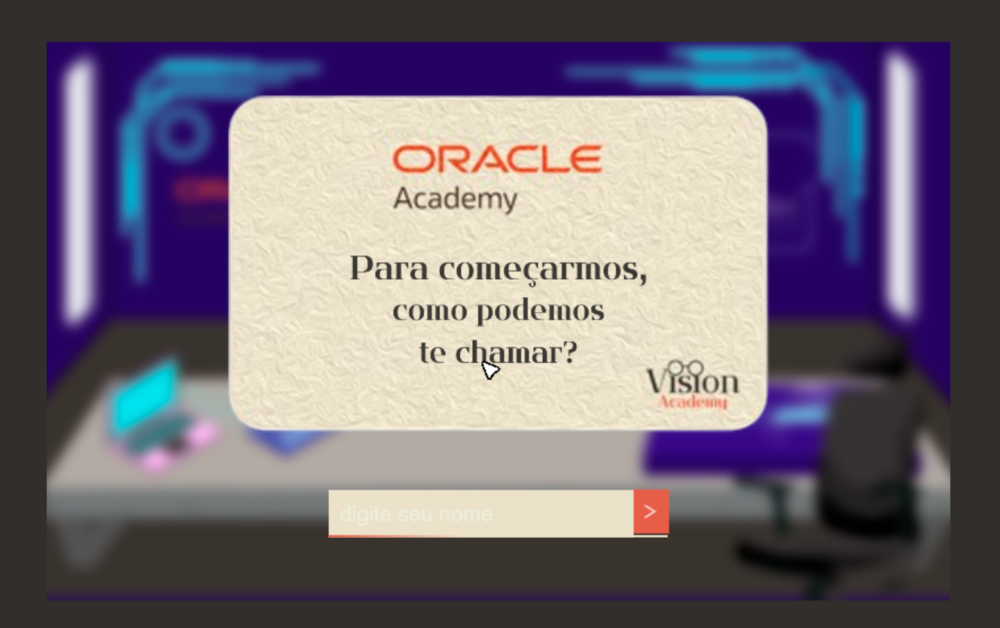
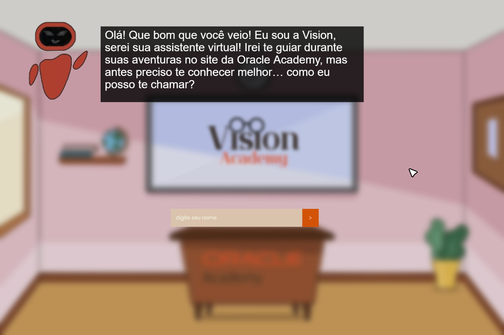
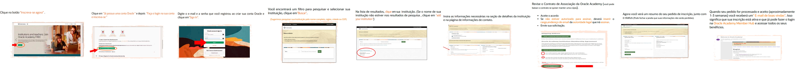

# GDD - Game Design Document - Módulo 1 - Inteli

**_Os trechos em itálico servem apenas como guia para o preenchimento da seção. Por esse motivo, não devem fazer parte da documentação final_**

## Tri-Database

## Integrantes
#### João Victor de Souza
#### Eduardo Faris Libutti Salles
#### Lucas Paiva Brasil
#### Lucas Cozzolino Tort
#### Mariella Sayumi Mercado Kamezawa
#### Nicolas Ramon da Silva
#### Rafaela Silva de Oliveira Lima

## Sumário

[1. Introdução](#c1)

[2. Visão Geral do Jogo](#c2)

[3. Game Design](#c3)

[4. Desenvolvimento do jogo](#c4)

[5. Casos de Teste](#c5)

[6. Conclusões e trabalhos futuros](#c6)

[7. Referências](#c7)

[Anexos](#c8)

 

# 1. Introdução (sprints 1 e 4)

## 1.1. Escopo do Projeto

### 1.1.1. Contexto da indústria (sprints 1 e 4)
 &nbsp;&nbsp;&nbsp;&nbsp; Esta seção busca contextualizar a Oracle Academy dentro do mercado em que está inserida.
  &nbsp;&nbsp;&nbsp;&nbsp; A Oracle Academy é uma organização filantrópica da Oracle dedicada ao ensino de tecnologia e computação para milhares de alunos em todo o mundo, oferecendo seus serviços de forma gratuita e com certificação internacional. Atuando em um mercado de rápido crescimento, o setor da educação em tecnologia. A empresa visa formar profissionais altamente capacitados para atender à crescente demanda do mercado. Enfrentando concorrência das principais empresas de tecnologia, tais como Microsoft, Google, Amazon Web Services (AWS), IBM e Salesforce, a Oracle Academy se destaca ao focar em seu core business: a educação, a qual distribui seus conteúdos por meio de parcerias estratégicas com instituições de ensino e educadores, visando gerar um fortalecimento de lealdade com os clientes e até mesmo recrutamento de talentos. Além disso, é crucial ressaltar algumas das tendências e possíveis mudanças na indústria, como a crescente relevância da inteligência artificial, computação em nuvem e segurança cibernética.

### 1.1.2. Análise SWOT (sprints 1 e 4)

&nbsp;&nbsp;&nbsp;&nbsp; A análise SWOT é uma ferramenta utilizada para avaliar os pontos fortes, pontos fracos, oportunidades e ameaças de uma empresa ou projeto. Por isso, foi essencial realizar essa análise no projeto.

Figura 1 - Análise SWOT

Fonte: Material produzido pelos autores (2024)

&nbsp;&nbsp;&nbsp;&nbsp; A Oracle detém a liderança no mercado de software de banco de dados e é reconhecida globalmente. Suas soluções são amplamente adotadas por empresas e governos. No entanto, sua divisão filantrópica, a Oracle Academy, ainda carece do mesmo reconhecimento e visibilidade. O mercado da Oracle enfrenta uma concorrência intensa, competindo com grandes players da indústria, como Amazon, IBM e Microsoft. Nesse sentido, o investimento em novas tecnologias e na formação de profissionais torna-se crucial. É fundamental o sucesso do programa de especialização de professores da Oracle Academy para aproveitar todas as oportunidades de mercado existentes e garantir sua relevância contínua.

### 1.1.3. Descrição da Solução Desenvolvida (sprints 1 e 4)

&nbsp;&nbsp;&nbsp;&nbsp; Essa seção abordará a solução desenvolvida no jogo e como pode ser aproveitada pelo usuário. 
&nbsp;&nbsp;&nbsp;&nbsp; A Oracle desenvolve um programa de capacitação de professores em programação, com o intuito de formar alunos já imersos no universo da tecnologia. No entanto, a empresa enfrenta um desafio significativo em manter esses professores motivados e comprometidos com os cursos oferecidos, o que impacta diretamente o objetivo final do programa.
&nbsp;&nbsp;&nbsp;&nbsp; Para abordar essa questão, foi concebido um jogo 2D em primeira pessoa, desprovido de personagens, composto por 5 fases distintas: registro, familiarização com as plataformas e recursos disponíveis, canais de comunicação, computação em nuvem e participação em sessões de suporte ao membro. O jogo apresenta uma dinâmica baseada em flash cards, que introduzem os recursos de forma interativa, e conta com um design neutro, alinhado à cultura da Oracle. Trata-se de um "serious game" que busca equilibrar o aprendizado com o engajamento dos participantes.
&nbsp;&nbsp;&nbsp;&nbsp; Os benefícios proporcionados pelos serious games são significativos: eles promovem a aprendizagem ativa, permitindo que os usuários participem ativamente do processo educacional. Além disso, muitos serious games são projetados para simular situações do mundo real, possibilitando que os usuários apliquem o conhecimento adquirido em ambientes controlados.

### 1.1.4. Proposta de Valor (sprints 1 e 4)
&nbsp;&nbsp;&nbsp;&nbsp; O "Canvas Proposta de Valor" é uma ferramenta utilizada no desenvolvimento e na descrição da proposta de valor de um produto ou serviço. Trata-se de uma estrutura de planejamento estratégico utilizada por empreendedores e empresas para visualizar e comunicar como uma empresa cria valor para seus clientes.

Figura 2 - Canvas da Proposta de Valor do Projeto

Fonte: Material produzido pelos autores (2024)

### 1.1.5. Matriz de Riscos (sprints 1 e 4)

&nbsp;&nbsp;&nbsp;&nbsp; Uma matriz de risco, é uma ferramenta usada na gestão de riscos para visualizar e priorizar os riscos enfrentados por um projeto. Ela ajuda a identificar e avaliar os riscos potenciais, bem como a determinar a melhor forma de lidar com eles. 

#### Ameaças:

&nbsp;&nbsp;&nbsp;&nbsp; 1- Dificuldade no acesso - Moderada/20% - Plano de Ação: O jogo terá o intuito de ensinar e explicar de forma didática e divertida para todos os usuários. 

&nbsp;&nbsp;&nbsp;&nbsp; 2- Ideia do jogo não agradar o usuário - Baixa/5% - Plano de Ação: Se o usuário não gostar da ideia de um jogo, pode-se jogar apenas a primeira fase (login na Oracle Academy). 

&nbsp;&nbsp;&nbsp;&nbsp; 3- O usuário não querer jogar ou ter dificuldade no jogo - Baixa/10% - Plano de Ação: Para aqueles que tiverem dificuldade no jogo, é recomendado que contatem o suporte. 

&nbsp;&nbsp;&nbsp;&nbsp; 4- Fortes concorrentes no mercado - Alto/50% - Plano de Ação: Com a forte concorrência no mercado, destaca-se pela boa jogabilidade, design e didática dentro da plataforma. 

&nbsp;&nbsp;&nbsp;&nbsp; 5- Limitação por faixa etária - Muito Baixa/10% - Plano de Ação: A intenção primária é ensinar como usar a Oracle Academy de forma instrutiva, para que todos tenham a mesma experiência em nosso jogo. 

#### Oportunidades:

&nbsp;&nbsp;&nbsp;&nbsp; 1-Novos investidores para a plataforma - Alta/70% - Plano de Ação: Com a nova tendência dos Serious Games, espera-se a chegada de novos investidores para a Oracle Academy. 

&nbsp;&nbsp;&nbsp;&nbsp; 2-Presença em salas de aula - Moderada/30% - Plano de Ação: Logo após o usuário terminar de jogar, recomenda-se a Oracle Academy como ferramenta para a sala de aula.

&nbsp;&nbsp;&nbsp;&nbsp; 3-Presença nas empresas (treinamento) - Moderada/20% - Plano de Ação: Empresas treinam seus colaboradores para aprimorarem suas habilidades.

&nbsp;&nbsp;&nbsp;&nbsp; 4-Adesão de professores - Alta/60% - Plano de Ação: Como a Oracle Academy é direcionada para professores, espera-se um fluxo elevado de novos educadores na Oracle Academy. 

&nbsp;&nbsp;&nbsp;&nbsp; 5-Novos jogos/fases - Alto/50% - Plano de Ação: Criação e desenvolvimento de novas fases e cenários, caso haja uma alta adesão do público. 

&nbsp;&nbsp;&nbsp;&nbsp; 6-Novos conteúdos - Muito Alto/90% - Plano de Ação: Caso nosso jogo tenha muitos usuários, porém poucos logins na Oracle Academy, é recomendável atualizar o conteúdo para torná-lo mais direcionado à criação de contas. 

## 1.2. Requisitos do Projeto (sprints 1 e 2)

&nbsp;&nbsp;&nbsp;&nbsp; Na tabela estão expressos os requisitos exigidos pela Oracle Academy para o projeto. Esses requisitos são obrigatórios no jogo. 

Tabela 01 - Requisitos projeto 

\# | descrição |
--- | --- |
1 | Deve ser um Serious Game
2 | Não deve possuir personagem
3 | Deve ser web
4 | Deve possuir a indentidade visual da Oracle
5 | Deve possuir visual sóbrio
6 | O Jogo deve ser em primeira pessoa, tendo o professor como protagonista.

Fonte: Material produzido pelos autores (2024)

## 1.3. Público-alvo do Projeto (sprint 2)

&nbsp;&nbsp;&nbsp;&nbsp; Esse item descreve o público-alvo do jogo Vision Academy. O público-alvo é o principal grupo de usuários para quem o jogo é destinado. 

&nbsp;&nbsp;&nbsp;&nbsp; A plataforma pode atender professores de diversas regiões geográficas, com foco principal em grandes cidades,  áreas onde a educação é prioridade e regiões que necessitam de melhora na educação. O público alvo do jogo são os professores (sejam acadêmicos da rede privada ou pública), sendo o perfil do nosso professor: entusiasta do mundo da tecnologia ou procura entrar nesse mundo, professores predominantemente jovem, de 22 até mesmo de 65 anos, e um perfil de professor inovador, com uma perspectiva emergente sobre tecnologia: um  potencial de transformar o mundo e ,principalmente, a vida de seus alunos. A plataforma engloba as preferências dos professores, tanto aqueles que estão acostumados com a tecnologia quanto aqueles que são iniciantes ou não têm o costume com a tecnologia. Os professores que estão confortáveis com a tecnologia podem preferir aulas ou cursos mais avançados, enquanto, o outro perfil pode preferir uma abordagem mais amigável, didática e simples. 

# 2. Visão Geral do Jogo (sprint 2)

## 2.1. Objetivos do Jogo (sprint 2)

&nbsp;&nbsp;&nbsp;&nbsp; Nessa seção, são descritos os principais objetivos do jogo. Os objetivos do jogo são fundamentais para entender como ele irá se comunicar com o público. 

&nbsp;&nbsp;&nbsp;&nbsp; Desenvolver um serious game que mostre de maneira clara e engajadora todos os conteúdos disponibilizados na plataforma da Oracle Academy aos quais os professores têm acesso ao se tornarem membros do programa, incentivando sua utilização. Fazer um game que integre o professor na plataforma, de forma informativa e gamificada que possua uma estética sóbria e aquarelada com texturas próximas a identidade visual da Oracle Academy, sem personagens e com o professor como protagonista do jogo, onde o obejtivo final é a compreensão por completo dos conteúdos, como criar canais na plataforma, participação em sessão ao membro e como criar uma conta Oracle cloud. 

## 2.2. Características do Jogo (sprint 2)

### 2.2.1. Gênero do Jogo (sprint 2)

&nbsp;&nbsp;&nbsp;&nbsp; O termo "gênero de jogo" se refere às categorias ou classificações atribuídas aos jogos com base em características específicas, como jogabilidade, enredo, mecânicas, temática e outros elementos. 

&nbsp;&nbsp;&nbsp;&nbsp; O gênero escolhido para o projeto é o “serious game” , baseado no que o público alvo deseja e no que a própria Oracle apresentou, por esse motivo foi definido esse tipo de jogo. A definição de serious game ou jogo sério é:[1] serious game refere-se a jogos digitais desenvolvidos com o propósito principal de fornecer uma experiência educacional, informativa e/ou de treinamento, em contraste com jogos desenvolvidos para o entretenimento. 
 
### 2.2.2. Plataforma do Jogo (sprint 2)

&nbsp;&nbsp;&nbsp;&nbsp; A plataforma de um jogo engloba o ambiente no qual o jogo é criado, distribuído e jogado. Isso inclui tanto o hardware quanto o software necessários para a execução do jogo.

&nbsp;&nbsp;&nbsp;&nbsp; O jogo será disponibilizado via desktop e mobile, onde o professor poderá ter acesso em qualquer lugar ou hora. Disponibilizados nos sistemas web, Android e IOS. 

### 2.2.3. Número de jogadores (sprint 2)

&nbsp;&nbsp;&nbsp;&nbsp; Este elemento aborda o número de jogadores que podem participar do jogo, seja simultaneamente em modo multiplayer ou individualmente em modo single player.

&nbsp;&nbsp;&nbsp;&nbsp; O game será com apenas um jogador controlável, sendo este o professor e o centro da experiência gamificada. 

### 2.2.4. Títulos semelhantes e inspirações (sprint 2)

&nbsp;&nbsp;&nbsp;&nbsp; Nesta seção, são descritas algumas inspirações ou jogos que compartilham semelhanças com o Vision Academy. 
&nbsp;&nbsp;&nbsp;&nbsp; O nosso grupo se inspirou no jogo Carto para fazer animações em quadro e na cencept art do jogo que se assemelha com a identidade visual da Oracle Academy.

### 2.2.5. Tempo estimado de jogo (sprint 5)

&nbsp;&nbsp;&nbsp;&nbsp; Este item descreve a duração estimada para que o usuário percorra o jogo do início ao fim. Essa informação auxilia na compreensão do nível de envolvimento proporcionado pelo jogo. 

 &nbsp;&nbsp;&nbsp;&nbsp; O jogo pode ser concluído em 15 minutos passando por todas as 5 fases. Cada fase possui 3 min de duração em média. 

# 3. Game Design (sprints 2 e 3)

## 3.1. Enredo do Jogo (sprints 2 e 3)

&nbsp;&nbsp;&nbsp;&nbsp; O enredo de um jogo é a história principal que conta o que está acontecendo e por que o jogador está lá. Ele explica o que o jogador precisa fazer para chegar ao final do jogo. Em resumo, o enredo mostra aos jogadores o que esperar enquanto eles jogam.

&nbsp;&nbsp;&nbsp;&nbsp; No jogo, o jogador assume o papel de um professor que pretende ingressar na Oracle Academy, para isso é apresentado um óculos de realidade virtual, que insere o player em um mundo futurista. Logo após ativar os óculos, uma figura virtual se apresenta como guia, a Vision, ela oferece conselhos e instruções enquanto você explora os ambientes e funcionalidades da Academy. Ao longo do processo, o professor encontra flashcards digitais contendo informações sobre criação de conta, canais, inscrição em cursos e navegação pelos conteúdos. A guia virtual utiliza o conteúdo dos flashcards para criar quizes, testando sua compreensão sobre a Oracle Academy. Com a orientação da guia virtual e dedicação do profissional, a experiencia no programa filantrópico da oracle será facilitada e simplificada. 

## 3.2. Personagens (sprints 2 e 3)

### 3.2.1. Controláveis

&nbsp;&nbsp;&nbsp;&nbsp; Esse item descreve todos os personagens controláveis do jogo, ou seja, qualquer personagem que o usuário possa controlar dentro do jogo. 

&nbsp;&nbsp;&nbsp;&nbsp; O único personagem que pode ser controlado é o usuário em primeira pessoa, o jogo foi proposto para haver apenas um personagem. O óculos de realidade virtual e flash cards também poderão ser interativos, de forma a trazer a experiência do nosso público-alvo mais imersiva e engajante. 

### 3.2.2. Non-Playable Characters (NPC)

&nbsp;&nbsp;&nbsp;&nbsp; NPC é a sigla para "Personagem Não Jogável". São personagens presentes dentro do jogo que não são controlados pelo jogador. Em vez disso, suas ações são determinadas pelo próprio jogo, seguindo rotinas ou scripts previamente definidos. 

&nbsp;&nbsp;&nbsp;&nbsp; O grupo concluiu que o jogo não contará com NPCs. Apesar da existência da guia (Vision), ela não é interativa de nenhuma maneira, tratando-se apenas de um elemento decorativo que aparece quando uma fase é chamada. 

### 3.2.3. Diversidade e Representatividade dos Personagens

&nbsp;&nbsp;&nbsp;&nbsp; Nesta seção, abordamos a representatividade e diversidade dos personagens em relação ao público-alvo do jogo. Isso significa considerar  elementos do jogo que possam fazer com que o usuário se sinta representado enquanto joga. 

&nbsp;&nbsp;&nbsp;&nbsp; O jogo foi feito de forma a garantir acessibilidade para o público que utiliza a Oracle Academy, professores interessados em ensinar tecnologia de todas as regiões do Brasil. Embora não apresente personagens, foram incorporadas legendas para auxiliar aqueles com problemas auditivos, promovendo inclusão e garantindo que todos os alunos tenham acesso igualitário ao conteúdo. Além disso, o design utiliza tons neutros para evitar sobrecarga sensorial, seguindo os princípios da psicologia das cores. Essa abordagem busca criar um ambiente acolhedor e atraente para os jogadores, independente de suas origens ou níveis de habilidade, proporcionando uma experiência de aprendizado inclusiva e acessível para todos os professores interessados em tecnologia no Brasil. 

## 3.3. Mundo do jogo (sprints 2 e 3)

### 3.3.1. Locações Principais e/ou Mapas (sprints 2 e 3)

&nbsp;&nbsp;&nbsp;&nbsp; Este elemento se relaciona com o ambiente onde o jogo acontece, mencionando algumas localidades e/ou o mapa do jogo. 

&nbsp;&nbsp;&nbsp;&nbsp; 1) Mapa de fases: Botão adicional do mapa de fases (no canto superior direito) onde o mapa de fases aparece no quadro da tela inicial.

&nbsp;&nbsp;&nbsp;&nbsp; 2) Tela inicial: O jogo começa com um cenário de sala aula comum em primeira pessoa, uma mesa e um óculos virtual sobre ela onde o personagem clica nele e começa a animação em primeira pessoa do óculos se aproximando até dar a sensação de encaixe no rosto.

&nbsp;&nbsp;&nbsp;&nbsp; 3) Fase 1: Após colocá-lo o professor entra na realidade virtual da Oracle Academy, onde surge uma assistente virtual do jogo chamada Vision que guiará o professor nessa jornada virtual e , assim, começa a fase de cadastro em outra sala de aula mas totalmente tecnológica, em que o professor coloca seu nome e e-mail e já avança para a próxima fase.

&nbsp;&nbsp;&nbsp;&nbsp; 4) Fase 2 e Fase 3 : um cenário repleto de servidores onde começa a navegação pelos conteúdos Oracle por meio de flash cards espalhados no cenário onde terão quizes ao longo do texto para engajar o professor e medalhas que recompensam o professor por performance, fazendo-o compreender os recursos disponibilizados na plataforma, já que o personagem só avança se acertar um número mínimo de quizzes. Ao passar para a terceira fase o jogador entra em um outro cenário de servidor onde irão ser apresentados conteúdos em flash cards e puzzles para engajar o professor sobre como criar canais e incluir conteúdos nos canais.

&nbsp;&nbsp;&nbsp;&nbsp; 5) Fase 4 e Fase 5: o jogador muda de cenário para outro em um ambiente de nuvem, onde vai ser a quarta e quinta fase do serious game, em que conteúdos informativos por meio de cards vão ser disponibilizados para informar a criação de conta em cloud e participação de sessão de membro e após essa última fase o jogador faz a animação de tirar o óculos em primeira pessoa em forma de quadrinho, passando de volta para o primeiro cenário de sala de aula.

### 3.3.2. Navegação pelo mundo (sprints 2 e 3)

&nbsp;&nbsp;&nbsp;&nbsp; Nesta seção, são descritos os caminhos que o jogador deve percorrer nos ambientes do jogo, bem como quaisquer limitações que o jogador possa encontrar ao longo do caminho. 
   
&nbsp;&nbsp;&nbsp;&nbsp; O usuário não irá se movimentar com as teclas de direção do teclado, ele irá se “movimentar” com o cursor do mouse. O usuário irá se mover pelas fases conforme for realizando os objetivos de cada fase ( realizar quiz, ler os flashcards, seguir as instruções), o jogador terá requisitos mínimos para se movimentar pelas fases, como por exemplo, acertar ⅓ do puzzles e realizar as leituras dos flashcards. O jogador vai se movimentando pelas fases 1 (fase do cadastro) para a fase 2 , da fase 2 (fase dos quizzes e flashcards, essa fase será para fixação do conteúdo de navegação pela plataforma da Oracle Academy) para a fase 3, da fase 3 (fase dos quizzes e flashcards, essa fase será a demonstração da criação de canais e adicionar conteúdos nos canais) para a fase 4 e da fase 4  para a última fase (a fase 4 e 5 ainda serão desenvolvidas). 

### 3.3.3. Condições climáticas e temporais (sprints 2 e 3)

&nbsp;&nbsp;&nbsp;&nbsp; Este item descreve as condições climáticas presentes no jogo, se houver alguma condição climática incluída na experiência. 

&nbsp;&nbsp;&nbsp;&nbsp; O jogo é ambientado em lugares fechados e sem visão para a área externa. 
 
### 3.3.4. Concept Art (sprint 2)

&nbsp;&nbsp;&nbsp;&nbsp; Concept art,  é uma forma de ilustração usada para transmitir uma ideia visualmente durante o processo de desenvolvimento de um projeto, como um filme ou um jogo. Essas ilustrações são criadas para explorar visualmente conceitos como personagens, cenários e atmosferas antes que sejam finalizados e implementados no produto final. 

Figura 3 - Concept Art

Fonte: Material produzido pelos autores (2024)

&nbsp;&nbsp;&nbsp;&nbsp; Na concept art existem diversos elementos dentre eles: sala de aula, barra de progresso, botão de jogar, medalha, certificado da oracle, nuvens, óculos VR, caixa de diálogo, logo das instituições e do nosso grupo e também o servidor. O grupo definiu os elementos da concept art da seguinte forma:

&nbsp;&nbsp;&nbsp;&nbsp; (1) Servidor: O servidor é o cenário em que vai passar as fases 1, 2, 3 e 4, a imagem da concept art foi uma inspiração para o nosso cenário atual.

&nbsp;&nbsp;&nbsp;&nbsp; (2) Sala de aula: O objetivo do projeto é engajar o professor para utilizar a Oracle Academy e posteriormente ensinar o que aprendeu na Oracle para os seus alunos, por conta disso foi adicionado a professora na sala de aula.  

&nbsp;&nbsp;&nbsp;&nbsp; (3) Barra de progresso: A barra de progresso foi uma das principais formas de engajar o usuário na plataforma.  

&nbsp;&nbsp;&nbsp;&nbsp; (4) Botão de jogar: A ideia inicial do projeto era ter o botão (jogar) para iniciar o jogo , porém foi descartada a ideia, mas foi adicionado na concept art como forma de inspiração para o projeto atual. 

&nbsp;&nbsp;&nbsp;&nbsp; (5) Medalha: A medalha é outro elemento de engajamento do usuário, é utilizado no jogo como forma de recompensa. 

&nbsp;&nbsp;&nbsp;&nbsp; (6) Certificado Oracle: Na concept art foi adicionado o certificado internacional da Oracle, quando o usuário termina um curso na Oracle ele recebe esse certificado. 

&nbsp;&nbsp;&nbsp;&nbsp; (7) Nuvens: As nuvens são uma marca registrada da Oracle, então foi adicionado na concept art com finalidade de familiarizar o usuário com a Oracle.  

&nbsp;&nbsp;&nbsp;&nbsp; (8) Óculos VR: O óculos de realidade virtual é a marca registrada do jogo Vision Academy. 

&nbsp;&nbsp;&nbsp;&nbsp; (9) Caixa de diálogo: A primeira interação do usuário com a assistente virtual do jogo. 

&nbsp;&nbsp;&nbsp;&nbsp; (10) Logos: Na concept art foi adicionado os logos da Inteli e do grupo Tri-Data Base em uma nuvem. 

### 3.3.5. Trilha sonora (sprint 3) 

&nbsp;&nbsp;&nbsp;&nbsp; Este elemento engloba a descrição de algumas trilhas sonoras presentes durante o jogo, além de descrever as situações em que essas trilhas sonoras são utilizadas. 

Tabela 02 - Tabela trilha sonora 

\# | titulo | ocorrência | autoria
--- | --- | --- | ---
1 | trilha sonora de início | tela de início | 
2 | trilha sonora animação do óculos| cena de colocar o óculos de realidade virtual | 
3 | trilha sonora servidor, flash card, quiz | na fase 2, o jogador irá para uma sala com servidores onde ele terá que fazer quiz e ver flash cards | 
4 | trilha sonora da criação de canais | na fase 3, o jogo irá mostrar a criação de canais dentro do Oracle Academy | 
5 | trilha sonora da fase nuvem | na fase 4, o jogador vai estar na introdução ao cloud da Oracle | 
6 | trilha sonora de tirar o óculos | cana de tirar o óculos de realidade virtual | 
7 | trilha sonora das recompensas (medalhas) | cena do recebimento da recompensa (medalhas) | 

Fonte: Material produzido pelos autores (2024)

&nbsp;&nbsp;&nbsp;&nbsp; Essa tabela foi dividida em três principais temas: titulo, ocorrência e autoria. No tema titulo, foi introduzido o motivo da trilha sonora. Em ocorrência foi adicionado a cena em que essa trilha sonora está introduzida e por último a autoria são os donos do direito da música. 

## 3.4. Inventário e Bestiário (sprint 3)

### 3.4.1. Inventário

###  Tabela - Inventário 

&nbsp;&nbsp;&nbsp;&nbsp; O inventário de um jogo é uma interface ou sistema que permite aos jogadores gerenciar e acessar os itens que coletaram ou adquiriram ao longo do jogo. Esses itens podem incluir armas, equipamentos, medalhas, chaves, recursos, missões, entre outros. 

Tabela 03 - Tabela inventário

\# | item | imagem | como obter | função | efeito sonoro
--- | --- | --- | --- | --- | ---
1 | Medalhas |  | Ao realizar quizzes | Engajar e recompensar uma boa performance | Não possui

Fonte: Material produzido pelos autores (2024)

&nbsp;&nbsp;&nbsp;&nbsp; O jogo não conta com itens, apenas insígnias que serão recompensadas ao jogador por concluir desafios, a medalha apresentada na tabela mostra como serão essas premiações. 

### 3.4.2. Bestiário

&nbsp;&nbsp;&nbsp;&nbsp; Um bestiário em um jogo é um catálogo de informações sobre as diversas criaturas ou inimigos encontrados ao longo da aventura. 

&nbsp;&nbsp;&nbsp;&nbsp;Por tratar-se de um serious game com o objetivo de ser um tutorial para a Oracle Academy o jogo não contará com inimigos. 

## 3.5. Gameflow (Diagrama de cenas) (sprint 2)

&nbsp;&nbsp;&nbsp;&nbsp; Gameflow, é um termo que se refere à sequência de eventos e ações que os jogadores experimentam ao longo da partida. Envolve a estruturação da jogabilidade desde o início até o final do jogo, incluindo a progressão do jogador, os desafios enfrentados, as decisões tomadas e as recompensas obtidas.

&nbsp;&nbsp;&nbsp;&nbsp; O jogo começa com um cenário de sala aula comum em primeira pessoa, possuindo uma mesa e um óculos virtual sobre ela o qual o personagem clica e começa a animação em primeira pessoa do óculos se aproximando até dar a sensação de encaixe no rosto. Após colocá-lo o professor entra na realidade virtual da Oracle Academy, onde surge uma asssitente virtual do jogo chamada Vision que guiará o professor nessa jornada virtual e, assim, a fase de cadastro é iniciada em uma outra sala de aula, porém muito mais tecnológica, na qual irá primeiro aparecer um tutorial de como deve ser feito o cadastro do usuário na plataforma da Oracle Academy. Após o usuário realizar seu cadastro ele será redirecionado à uma outra tela onde deverá inserir seu nome, assim já poderá seguir para a próxima fase.
&nbsp;&nbsp;&nbsp;&nbsp; Em seguida, o usuário é deslocado para um cenário repleto de servidores , os quais cada um irá possuir diferentes conteúdos, assim, podendo começar sua navegação pelos conteúdos Oracle, posteriormente, será realizado por meio de flash cards espalhados no cenário a navegação dos conteúdos, juntamente com quizzes e medalhas como forma de recompensa para o usuário baseado na sua performance. Em razão, do usuário compreender os recursos disponibilizados na plataforma, visto que o personagem só avança caso haja um número de acertos mínimos de quizzes. A cada fase que o jogador passa é liberado um próximo conteúdo para que o usuário faça os flash cards e os quizzes. 
&nbsp;&nbsp;&nbsp;&nbsp; Após o jogador  passar as fases que estão na sala de servidor ele será redirecionado para um ambiente de nuvem, onde vai ter as fases quatro e cinco que também irão ter flash cards e quizzes, porém relacionados a criação de contas cloud e participação de sessão de membro, em seguida, é mostrada uma animação em forma de quadrinhos do jogador tirando o óculos em primeira pessoa, assim voltando para o primeiro cenário de sala de aula. 

IMAGEM:

Figura 4- Diagrama de Cenas

Fonte: Material produzido pelos autores (2023)

## 3.6. Regras do jogo (sprint 3)

&nbsp;&nbsp;&nbsp;&nbsp; As regras de um jogo constituem um conjunto de diretrizes que determinam a maneira como o jogo é jogado e estabelecem as condições para ganhar ou perder. Elas estabelecem os limites e as restrições dentro das quais os jogadores podem interagir entre si e com o ambiente do jogo. 

&nbsp;&nbsp;&nbsp;&nbsp; Este jogo tem como finalidade ajudar os usuários a serem guiados através de diferentes fases para aprender e interagir com os recursos disponíveis. 
&nbsp;&nbsp;&nbsp;&nbsp; Na fase 1, os usuários são introduzidos ao sistema e ao jogo, e são apresentados aos conceitos básicos e à interface. Ao mesmo tempo, em que são realizado os cadastros dos usuários na plataforma do cliente.
&nbsp;&nbsp;&nbsp;&nbsp; Na fase 2, os jogadores precisam navegar pelos conteúdos e recursos disponíveis no sistema, o que inclui encontrar informações sobre os cursos oferecidos. Para avançar  para a próxima fase, os jogadores devem acertar um número mínimo de quizzes relacionados a esta fase, sendo aproximadamente  um terço do número total disponível.
&nbsp;&nbsp;&nbsp;&nbsp; Na fase 3, os jogadores são desafiados a criar canais ou grupos de estudo e a inscrever outros jogadores nesses canais. Para progredir, eles precisam resolver um quebra-cabeça relacionado a esta fase. As seguintes fases ainda serão desenvolvidas.
 
## 3.7. Mecânicas do jogo (sprint 3)

&nbsp;&nbsp;&nbsp;&nbsp; As mecânicas de um jogo são os sistemas, regras e interações que controlam a jogabilidade e influenciam a experiência dos jogadores ao longo do jogo. Elas desempenham um papel fundamental na criação de desafios, oportunidades e momentos de diversão ao longo da jornada do jogador. 

&nbsp;&nbsp;&nbsp;&nbsp; Ao iniciar o jogo, o usuário será direcionado para a tela inicial, onde se deparará com uma sala de aula virtual. Na mesa do professor, há um par de óculos de realidade virtual. Ao clicar com o mouse nos óculos VR, o usuário terá a sensação de que os óculos se encaixam em seu rosto. Após colocá-los, o ambiente virtual do jogo se transforma, dando início à interação com uma assistente virtual chamada Vision, que guiará o usuário durante a jornada virtual. Começa então a fase de cadastro, na qual o usuário fornecerá seu nome e e-mail antes de avançar para a próxima etapa.

&nbsp;&nbsp;&nbsp;&nbsp; Nas fases seguintes, o usuário será transportado para cenários repletos de servidores, onde poderá navegar pelos conteúdos Oracle utilizando flash cards espalhados no ambiente. Ao longo do texto, haverá quizzes para engajar o usuário, e medalhas serão concedidas como recompensa por seu desempenho, incentivando-o a compreender os recursos disponíveis na plataforma. O progresso do usuário dependerá da sua capacidade de responder corretamente a um número mínimo de quizzes.

&nbsp;&nbsp;&nbsp;&nbsp; Após completar esta fase, o jogador será levado para um novo cenário, ambientado em uma nuvem, onde se desenrolarão as quarta e quinta etapas do jogo. Nestas fases, serão disponibilizados conteúdos informativos por meio de cards, informando sobre a criação de conta na nuvem e a participação em sessões de membros.

&nbsp;&nbsp;&nbsp;&nbsp; Ao concluir a última fase, o jogador vivenciará a animação de retirar os óculos de realidade virtual em primeira pessoa, como se fosse um quadrinho, retornando assim ao cenário inicial da sala de aula.

# 4. Desenvolvimento do Jogo

## 4.1. Desenvolvimento preliminar do jogo (sprint 1)

&nbsp;&nbsp;&nbsp;&nbsp; Este item refere-se ao desenvolvimento preliminar do jogo. Esse desenvolvimento preliminar é descrito como todas as etapas que antecedem o jogo. Portanto, são todas as etapas realizadas antes de iniciar o projeto do jogo. 

Próximos Passos:
&nbsp;&nbsp;&nbsp;&nbsp; Estamos ansiosos para expandir ainda mais a funcionalidade e o apelo do jogo. Nossos próximos passos incluem:
Implementar animações mais complexas, como a de uma pessoa colocando um óculos de realidade virtual.
Desenvolver um menu completo que exiba as medalhas e conquistas do jogador, proporcionando uma experiência de progressão significativa.
Desafios e Oportunidades:

   Enfrentamos desafios ao equilibrar nossa ambição com as limitações de tempo e recursos. No entanto, vemos esses desafios como oportunidades para aprimorar nossas habilidades e fortalecer nossa colaboração como equipe. Podendo assim no próximo Sprint já entregar algo bem além de um protótipo.*

## 4.2. Desenvolvimento básico do jogo (sprint 2)

&nbsp;&nbsp;&nbsp;&nbsp; Nesta seção, descreve o desenvolvimento básico do jogo, ou seja, são descritas todas as etapas básicas do  jogo. 

   O jogo começa com um cenário de sala aula comum em primeira pessoa, uma mesa e um óculos de realidade virtual sobre ela onde o personagem clica no óculos e começa a animação em primeira pessoas do óculos se aproximando ate dar a sensação de encaixe no rosto([1], [2] e [3]).

[1]

[2]

[3]

   Após colocá-lo, o professor entra na realidade virtual onde ele se depara com outra sala de aula porém mais tecnologica e , assim, começa a fase de cadastro, onde o professor coloca seu nome e e-mail e já avança para a próxima fase.

   Imagem dos códigos do menu de configurações, do flashcards e dos quadrinhos da animação do óculos.

   Código dos quadrinhos da animação do óculos de realiadade virtual.

Código dos flash cards.

Código do menu de configurações.

## 4.3. Desenvolvimento intermediário do jogo (sprint 3) 

&nbsp;&nbsp;&nbsp;&nbsp; O desenvolvimento intermediário do jogo refere-se às etapas principais do jogo, ou seja, são as etapas em que todo o processo do jogo é efetivamente desenvolvido. 

&nbsp;&nbsp;&nbsp;&nbsp; Na terceira Sprint, avançamos significativamente no desenvolvimento do jogo. Uma das principais entregas foi a implementação da assistente virtual denominada Vision. Vision foi projetada para guiar o jogador por meio de balões de diálogo, oferecendo orientações em momentos estratégicos durante o jogo.

&nbsp;&nbsp;&nbsp;&nbsp; O código da Vision foi feito com simplicidade, tornando-o facilmente replicável e escalável. Ele foi integrado ao jogo de forma a aparecer em momentos pré-definidos, conforme o progresso do jogador, sem interferir na jogabilidade principal. A interface de interação da Vision foi simplificada, apresentando diálogos de fácil compreensão para atingir um público mais amplo. Seus diálogos são direcionados para auxiliar o jogador a acessar os quizzes e flashcards disponíveis no jogo.

Figura 5 - Cadastro com a Vision 

Fonte: Material produzido pelos autores (2024)

&nbsp;&nbsp;&nbsp;&nbsp; Além da implementação da Vision, outra adição ao código foi a criação de duas novas cenas de desafio. A primeira cena introduz um quiz, criado para testar o conhecimento do jogador sobre o processo de criação de contas. Já a segunda cena apresenta uma abordagem semelhante a um "carrossel", exibindo informações relevantes sobre o processo de criação de contas da Oracle Academy. Essas adições diversificam os desafios no jogo, e também oferecem aos jogadores momentos de aprendizado e engajamento com o conteúdo educacional da Oracle Academy.

Figura 6 - Imagem do carrosel 

Fonte: Material produzido pelos autores (2024)

&nbsp;&nbsp;&nbsp;&nbsp; Outra mudança de menor escala foi a alteração estética da primeira fase do game e da cutscene dos óculos de realidade virtual.

Figura 7 - Sala de aula tela inicial 

Fonte: Material produzido pelos autores (2024)

Dificuldades Encontradas:

&nbsp;&nbsp;&nbsp;&nbsp; Durante a implementação da Vision, uma das dificuldades enfrentadas foi garantir que sua presença não interferisse excessivamente na experiência de jogo. Foi necessário ajustar o momento e a frequência de suas aparições para evitar distrações ao jogador.

Próximos Passos:

&nbsp;&nbsp;&nbsp;&nbsp; Para as próximas iterações, pretendemos aumentar o número e tipo de quizzes, ampliar o envolvimento da Vision com o game e iniciar o desenvolvimento do sistema de medalhas.

## 4.4. Desenvolvimento final do MVP (sprint 4)

&nbsp;&nbsp;&nbsp;&nbsp; Na fase final do desenvolvimento do MVP (Minimum Viable Product), o produto é refinado e aprimorado até alcançar sua versão final, pronta para ser lançada no mercado ou utilizada pelos usuários finais. 

*Descreva e ilustre aqui o desenvolvimento da versão final do jogo, explicando brevemente o que foi entregue em termos de MVP. Utilize prints de tela para ilustrar. Indique as eventuais dificuldades e planos futuros.*

## 4.5. Revisão do MVP (sprint 5)

&nbsp;&nbsp;&nbsp;&nbsp; A revisão do MVP, é uma análise minuciosa do produto mínimo viável é conduzida antes de seu lançamento oficial ou disponibilização para os usuários finais. Neste processo, uma equipe avalia criteriosamente o produto em relação aos objetivos iniciais, às necessidades dos usuários e aos requisitos do mercado. 

*Descreva e ilustre aqui o desenvolvimento dos refinamentos e revisões da versão final do jogo, explicando brevemente o que foi entregue em termos de MVP. Utilize prints de tela para ilustrar.*

# 5. Testes (sprint 4)

## 5.1. Casos de Teste

### Tabela - Casos de teste

&nbsp;&nbsp;&nbsp;&nbsp; Casos de teste são registros detalhados que descrevem as condições, ações e resultados esperados para avaliar uma função específica de um software. Sua elaboração ocorre durante o processo de desenvolvimento, visando assegurar que o software cumpra os requisitos tanto do negócio quanto do usuário, garantindo, assim, sua qualidade e confiabilidade. 

Tabela 04 - Casos de teste

\# | pré-condição | descrição do teste | pós-condição 
--- | --- | --- | --- 
1 |Jogo iniciado | Efeito fadeIn | Tela inicial passa a ser mostrada em sua totalidade
2 | Passar o mouse encima do óculos |  Verifica se o mouse está sobre o óculos | Óculos tem sua iluminação alterada e se torna interativo
3 | Clicar no óculos | É verificado se o botão esquerdo do mouse está pressionado |  É chamada a cena com a animação em quadros
4 | A tela da animação em quadros começa a contar quatro “timers” diferentes | Os quatro “timers” acabam, mostrando as imagens do óculos sendo colocado | A próxima cena é chamada.
5 | Janela para inserir o nome do jogador | Liberado botão de prosseguir | Texto com o nome do jogador é mostrado

Fonte: Material produzido pelos autores (2024)

&nbsp;&nbsp;&nbsp;&nbsp; Nesta tabela foi adicionado os casos de teste do nosso projeto, a tabela foi dividida em três temas: pré-condição, descrição do teste e pós condição. No tema pré-condição se refere ao que o teste se propõe a ser feito, no tema descrição do teste se refere à ação feita no teste, e o último tema se refere ao que vai acontecer após o teste. 

## 5.2. Testes de jogabilidade (playtests) (sprint 4)

### 5.2.1 Registros de testes

*Descreva nesta seção as sessões de teste/entrevista com diferentes jogadores. Registre cada teste conforme o template a seguir.*

Nome | João Jonas (use nomes fictícios)
--- | ---
Já possuía experiência prévia com games? | sim, é um jogador casual
Conseguiu iniciar o jogo? | sim
Entendeu as regras e mecânicas do jogo? | entendeu as regras, mas sobre as mecânicas, apenas as essenciais, não explorou os comandos complexos
Conseguiu progredir no jogo? | sim, sem dificuldades  
Apresentou dificuldades? | Não, conseguiu jogar com facilidade e afirmou ser fácil
Que nota deu ao jogo? | 9.0
O que gostou no jogo? | Gostou  de como o jogo vai ficando mais difícil ao longo do tempo sem deixar de ser divertido
O que poderia melhorar no jogo? | A responsividade do personagem aos controles, disse que havia um pouco de atraso desde o momento do comando até a resposta do personagem

### 5.2.2 Melhorias

*Descreva nesta seção um plano de melhorias sobre o jogo, com base nos resultados dos testes de jogabilidade*

# 6. Conclusões e trabalhos futuros (sprint 5)

*Escreva de que formas a solução do jogo atingiu os objetivos descritos na seção 1 deste documento. Indique pontos fortes e pontos a melhorar de maneira geral.*

*Relacione os pontos de melhorias evidenciados nos testes com plano de ações para serem implementadas no jogo. O grupo não precisa implementá-las, pode deixar registrado aqui o plano para futuros desenvolvimentos.*

*Relacione também quaisquer ideias que o grupo tenha para melhorias futuras*

# 7. Referências (sprint 5)

_Incluir as principais referências de seu projeto, para que seu parceiro possa consultar caso ele se interessar em aprofundar. Um exemplo de referência de livro e de site:_ 

item 2.2.1- [1] - Fonte: Meterial produzido pela Andreia da Silva Justo (2021), site: Twygo, link: https://twygo.com/blog/seriousgames/#:~:text=Serious%20games%20s%C3%A3o%20jogos%20com,com%20objetivos%20publicit%C3%A1rios%20ou%20pol%C3%ADticos

LUCK, Heloisa. Liderança em gestão escolar. 4. ed. Petrópolis: Vozes, 2010.  
SOBRENOME, Nome. Título do livro: subtítulo do livro. Edição. Cidade de publicação: Nome da editora, Ano de publicação.  

INTELI. Adalove. Disponível em: https://adalove.inteli.edu.br/feed. Acesso em: 1 out. 2023  
SOBRENOME, Nome. Título do site. Disponível em: link do site. Acesso em: Dia Mês Ano

# Anexos

*Inclua aqui quaisquer complementos para seu projeto, como diagramas, imagens, tabelas etc. Organize em sub-tópicos utilizando headings menores (use ## ou ### para isso)*
